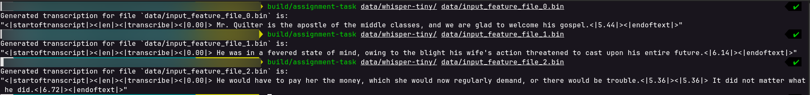

### Assignment.

**Goal**: Implement the incomplete `Generate(...)` function in `lib/translate.cc` (line number `745`). For this, a Python file `generate.py` containing equivalent logic has been provided. You need to complete the function using equivalent C++ code.

The remaining incomplete functions in `lib/translate.cc`, are **optional** to implement. You can either come up with your own logic for them, or use some separate logic and skip using them completely. All the incomplete functions have this block comment in their body:
```
/**
 * TASK: Complete this function.
*/
```
<br><br>
To get an idea of the C++ logic required for GPU code, you can go through the Python source files `data/whisper-tiny/vulkan/debug_dump`.

You may wish to go through the MLC LLM submodule, since this assignment leverages functionality from there as well.
<br><br>
In particular, source files such as `mlc-llm/cpp/llm_chat.cc` might be especially helpful. As an example, you can call a CUDA function (e.g., `prefill`) like so:
<br>
```
    // Get the logits of the next token
    ObjectRef ret = ft_.prefill_func_(input_data, cur_pos_shape,  // generated_tokens_length_shape
                                      all_encoder_key_value_, kv_cache_, params_);
```
<br><br>
The output we are looking for is something similar to:
<br><br>

<br><br>
That is, one should be able to call the executable using the given feature file(s) as argument(s) from the terminal like so (assuming we're in the build directory):
```bash
./assignment-task ../data/whisper-tiny ../data/input_feature_file_0.bin
```
<br><br>
Build system being used is CMake, which has already been configured for you. To build the project (assuming we're in the toplevel directory):
```bash
mkdir build && cd build
cmake .. && cmake --build .
```
To run the executable (assuming we're in the build directory):
```bash
./assignment-task ../data/whisper-tiny ../data/input_feature_file_0.bin
./assignment-task ../data/whisper-tiny ../data/input_feature_file_1.bin
./assignment-task ../data/whisper-tiny ../data/input_feature_file_2.bin
```
You may wish to go through the toplevel <code>CMakeLists.txt</code> once.
<br><br><br>
Good luck!

